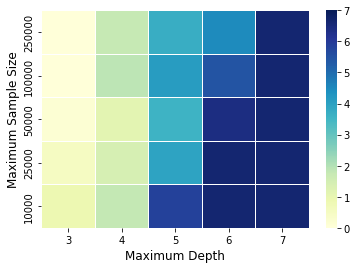
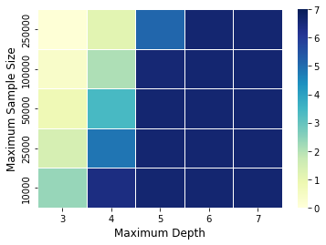
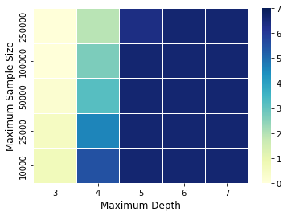

# A Generic Approach for Reproducible Model Distillation

This repository contains the implementation for the paper ["A Generic Approach for Reproducible Model
Distillation"](https://arxiv.org/abs/2211.12631) in Python. 

## Summary of the paper

Model distillation has been a popular method for producing interpretable machine learning. It uses an interpretable "student" model to mimic the predictions made by the black box "teacher" model. However, when the student model is sensitive to the variability of the data sets used for training, the corresponded interpretation is not reliable. Existing strategies stabilize model distillation by checking whether a large enough corpus of pseudo-data is generated to reliably reproduce student models, but methods to do so have so far been developed for a specific student model. In this paper, we develop a generic approach for stable model distillation based on central limit theorem for the average loss. We start with a collection of candidate student models and search for candidates that reasonably agree with the teacher. Then we construct a multiple testing framework to select a corpus size such that the consistent student model would be selected under different pseudo sample. We demonstrate the application of our proposed approach on three commonly used intelligible models: decision trees, falling rule lists and symbolic regression. Finally, we conduct simulation experiments on Mammographic Mass and Breast Cancer datasets and illustrate the testing procedure throughout a theoretical analysis with Markov process.

**Figures**:  
| Decision Tree | Falling Rule List | Symbolic Regression |
| :-------:    |  :-------: |  :-------: | 
|    |  |  |
| Mammographic Mass Data | Breast Cancer Data |  Independent Sampling |
|    |  |  |

## Requirement
Use `pip3 install -r requirements.txt` to install required packages.

In addtion, to install the `pyfim` package, use the following commands in order:

- `cd FRL/pyfim`
- `chmod +x setup.py`
- `python setup.py install`

## File Overview
- `FRL/`: This folder contains all python codes for the distillation of Falling Rule List model
  - `monotonic/`: This folder contains the implementation of Falling Rule List model (https://users.cs.duke.edu/~cynthia/code.html)
  - `pyfim/`: This folder helps to install the pyfim package for creating the rule set.
  - `result/`: This folder is where the results should go. First run `load_results.ipynb` to load the results and then run `plot.Rmd` to generate the plots.
  - `distill_utils.py`: This contains the utility functions.
  - `run_FRL_data1.py`: The code to run the experiments for Mammographic Mass Data.
  - `run_FRL_data2.py`: The code to run the experiments for Breast Cancer Data.
  - `run.sh`: Run the commands inside it to reproduce the results of the paper.
- `SymRegress/`: This folder contains all python codes for the distillation of Symbolic regression model
  - `gplearn/`: This folder contains the implementation of Symbolic regression model (https://gplearn.readthedocs.io/en/stable/)
  - `result/`: This folder is where the results should go. First run `load_results.ipynb` to load the results and then run `plot.Rmd` to generate the plots.
  - `run_symbolic_data1.py`: The code to run the experiments for Mammographic Mass Data.
  - `run_symbolic_data2.py`: The code to run the experiments for Breast Cancer Data.
  - `run.sh`: Run the commands inside it to reproduce the results of the paper.
- `Tree/`: This folder contains all python codes for the distillation of Decision Tree model
  - `result/`: This folder is where the results should go. First run `load_results.ipynb` to load the results and then run `plot.Rmd` to generate the plots.
  - `run_tree_data1.py`: The code to run the experiments for Mammographic Mass Data.
  - `run_tree_data2.py`: The code to run the experiments for Breast Cancer Data.
  - `run.sh`: Run the commands inside it to reproduce the results of the paper
- `uci_mammo_data.csv`: Mammographic Mass Data

## Citation
 
Please cite our paper
["A Generic Approach for Reproducible Model Distillation"](https://arxiv.org/abs/2211.12631) 

``` 
@article{zhou2022generic,
  title={A Generic Approach for Statistical Stability in Model Distillation},
  author={Zhou, Yunzhe and Xu, Peiru and Hooker, Giles},
  journal={arXiv preprint arXiv:2211.12631},
  year={2022}
}
``` 
